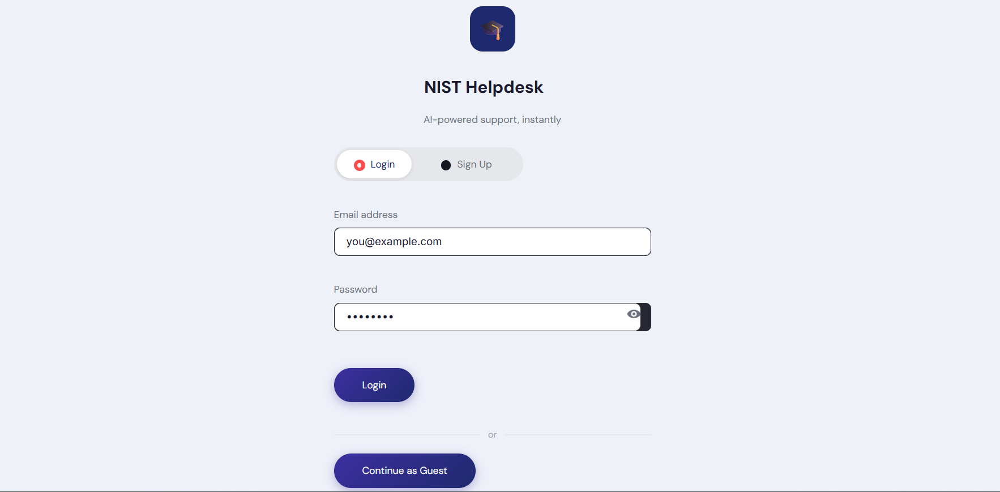
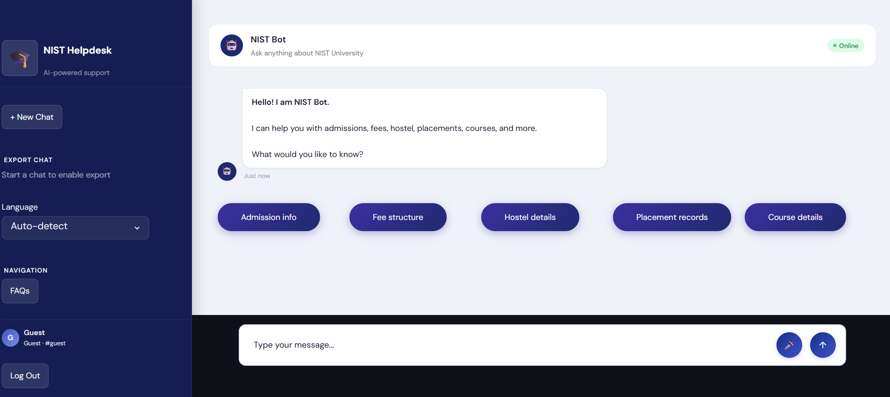
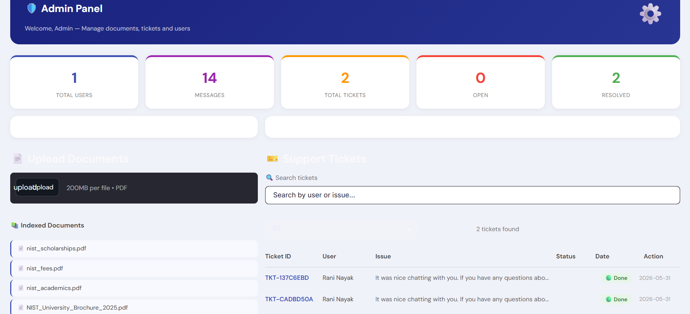

# 🎓 AI-Powered University Helpdesk — NIST University

[](https://ai-chatbot-si7w.onrender.com)

An intelligent RAG-based chatbot that answers student queries about NIST University Berhampur using university documents. Supports English, Hindi, and Odia languages.

🌐 **Live Demo:** https://ai-chatbot-si7w.onrender.com

> ⚠️ Hosted on Render free tier — first load may take 20-30 seconds if the service has spun down.

## 📸 Screenshots

| Login | Chat | Admin Dashboard |
|-------|------|-----------------|
|  |  |  |

> Add screenshots by running the app, taking screenshots, and saving them to `docs/screenshots/`.

## 🏗️ Architecture
```
Student Question → Streamlit UI → FastAPI → RAG Pipeline → FAISS Search → Groq LLM → Answer
```


## 🛠️ Tech Stack
- **LLM** — Groq (llama-3.3-70b-versatile)
- **RAG Framework** — LangChain
- **Vector Database** — FAISS
- **Embeddings** — FastEmbed (BAAI/bge-small-en-v1.5, ONNX)
- **Backend** — FastAPI + Uvicorn
- **Frontend** — Streamlit
- **Database** — SQLite
- **Auth** — JWT + bcrypt
- **Language Detection** — langdetect

## 💡 Features
- Ask questions about admissions, fees, hostel, placements, exams
- Upload any university PDF and get instant answers
- Multilingual support — English, Hindi, Odia with auto language detection
- JWT-based login/signup with role-based access (admin vs student)
- Admin panel — manage tickets, view stats, upload documents
- Support ticket system
- Streaming LLM responses
- REST API backend with Swagger docs at `/docs`

## ⚙️ How to Run

### 1. Clone the repo
```bash
git clone https://github.com/YOUR_USERNAME/ai-university-helpdesk.git
cd ai-university-helpdesk
```

### 2. Create virtual environment
```bash
python -m venv rag_env
rag_env\Scripts\activate
```

### 3. Install dependencies
```bash
pip install -r requirements.txt
```

### 4. Create .env file
```env
GROQ_API_KEY=your_groq_api_key_here
JWT_SECRET=your_random_secret_here
ADMIN_PASSWORD=your_admin_password_here
FAISS_INDEX_PATH=faiss_index/
DATA_PATH=data/
```

Get a free Groq API key at https://console.groq.com

### 5. Build FAISS index
```bash
python rebuild_index.py
```

### 6. Start FastAPI backend
```bash
python -m uvicorn backend.main:app --reload
```

### 7. Start Streamlit frontend
```bash
streamlit run frontend/app.py
```

### 8. Open browser
```
http://localhost:8501
```

## 📁 Project Structure
```
ai-university-helpdesk/
├── backend/
│   ├── main.py          # FastAPI app
│   ├── routes.py        # API endpoints
│   ├── rag_pipeline.py  # RAG logic
│   ├── database.py      # SQLite models & queries
│   └── utils.py         # Helper functions
├── frontend/
│   ├── app.py           # Streamlit entry point
│   ├── login.py         # Login/signup screen
│   ├── chat.py          # Chat interface
│   ├── dashboard.py     # Student dashboard
│   ├── admin.py         # Admin panel
│   └── style.css        # UI styles
├── data/                # University PDFs
├── docs/                # Architecture diagram & screenshots
├── .env                 # Config (not committed)
├── .env.example         # Example config
├── rebuild_index.py     # Script to rebuild FAISS index
└── requirements.txt
```

## 🎯 API Endpoints
| Method | Endpoint | Description |
|--------|----------|-------------|
| GET | /api/health | Check server status |
| POST | /api/auth/signup | Register a new user |
| POST | /api/auth/login | Login and get JWT token |
| POST | /api/ask-stream | Ask a question (streaming) |
| POST | /api/ask-sync | Ask a question (sync) |
| POST | /api/upload | Upload university PDF (admin) |
| GET | /api/documents | List uploaded PDFs |
| GET | /api/sessions/{user_id} | Get chat sessions |
| GET | /api/messages/{session_id} | Get chat messages |
| POST | /api/tickets | Raise a support ticket |
| GET | /api/tickets | Get all tickets (admin) |
| GET | /api/stats | Get usage statistics |

## 👨💻 Built By
RANI NAYAK — NIST University Berhampur
